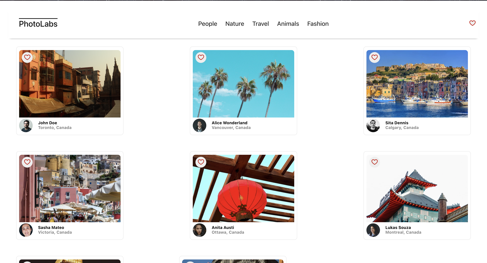
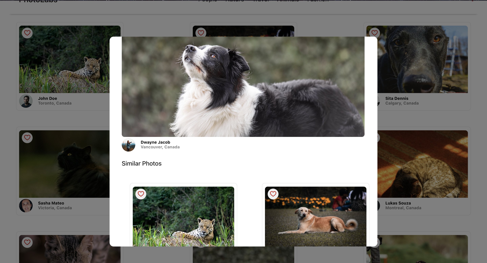

# Photolabs

The PhotoLabs project for the Web Development React course programming.

This single-page application allows users to view photos in different contexts.

## Learning Outcome

This project helped me gain a deeper understanding of the following concepts:

- React
  - Managing state: useState (refactored to utilize useReducer). Global state vs component state.
  - Interact with backend API fetching with useEffect
    - Rerendering upon dependency change, or rendering upon inital render.
  - Functional components
  - Props

## Setup

[Backend Setup Instructions](/backend/README.md)

[Frontend Setup Instructions](/frontend/README.md)

## Final Product

There are two primary conponents - The Home Route and the Photo Details Modal that shows a larger version image and other similar photos.

### Home Page

This is the home page with the "Travel" topic toggled to show photos in the travel context.

### Photo Details Modal

This is the photo details modal which shows a larger scale photo and also loads similar photos to view.

All the favorite buttons work in any view and its state is kept globally and will notify the user when any photo is liked on the top navigation bar.
